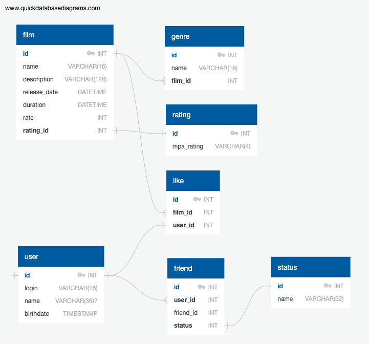

# java-filmorate
Template repository for Filmorate project.

### Images ER diagram

### Examples SQL requests
#### Добавление фильмов /films
INSERT INTO FILMS (ID, NAME, DESCRIPTION, RELEASE_DATE, DURATION, RATE, MPA_RATING)
VALUES (?, ?, ?, ?, ?, ?, ?)
                
#### Получение списка друзей /{id}/friends]
   
      SELECT u.id, u.login, u.name, u.BIRTHDAY, u.EMAIL FROM friends AS fr
      LEFT JOIN users AS u
      ON fr.friend_id = u.id
      WHERE fr.user_id = ?
      AND fr.STATUS = 1

#### Получение общих друзей

    SELECT
        f.friend_id
    FROM friends AS f
    WHERE user_id = 1 
    AND user_id = 2
    GROUP BY id

#### Получить список популярных фильмов

    SELECT
        f.film_id
    FROM film AS f
    JOIN like AS l ON l.film_id = f.film_id
    ORDER BY l.id DESC
    LIMIT 10
